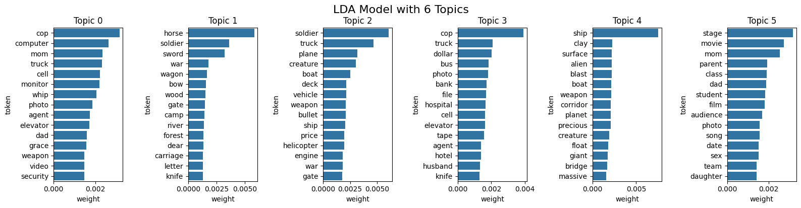

# NLP Movie Script Genre Classifier

## Task 1 – Text Preprocessing & Vectorization
### Dataset Creation
The Internet Movie Script Database was scraped using requests and BeautifulSoup. Script text for 1,259 movies was saved to a CSV file, along with the titles and associated genres. Once the initial data collection was complete, we used spaCy to remove non-English scripts, for a final dataset size of 1,211 entries.

### Text Preprocessing 
The script column of the database contains a lengthy string of unstructured text pertaining to the movie script and contains stage instructions, signs, and script elements that are uniquely formatted in each script and considered noise; these elements are first removed and then passed into an instance of a SpaCy NLP model for data cleaning and lemmatization. 

An extensive list of custom stop-words was built using the English language stop-word lists from NLTK and SpaCy; custom stop-words were also added after inspecting results following each iteration of running the preprocessing pipeline. The selected custom stop-words generally fall under the categories of script formatting terms, camera/directing instructions, character or action cues, dialogue exclamations, scene locations/objects, written numbers, extremely common violence descriptors, profanity, and symbols. 

The text is tokenized and filtered with this stop-word list, as well as removing tokens that are punctuation, numerical digits or whitespace. Tokens with a part-of-speech other than nouns, verbs, adjectives are also filtered out, as well as one-character and two-character words that are usually non-descriptive in the English language. Finally, the SpaCy model’s NER is used to recognize and remove tokens containing names of people; the small version of the model proved to be insufficient for filtering entity names and required an upgrade to the medium English model for adequate results. 

The main filtering function with NER was parallelized to process in batches across multiple cores due to initially extensive runtimes on a single processing core. 

### TF-IDF Vectorization
TF-IDF vectorization was implemented dynamically as part of a pipeline when training our classification models. The parameters min_df and max_df were chosen based on the final model performance using GridSearchCV.

### Doc2Vec Vectorization

This section examines Doc2Vec for representing movie scripts as numerical vectors. Doc2Vec extends Word2Vec to encode entire documents, capturing semantic relationships across the full scripts of our data set, rather than individual words. Our implementation generated 200 dimensional vectors for around 1209 movie scripts, sufficiently to generate genre classification while preserving narrative context. 

To optimize our feature space, we compared Truncated SVD and PCA for dimensionality reduction of the Doc2Vec representations. Our analysis involved evaluating performances across various component thresholds (50, 100, 150). 

Our comparative analysis of PCA and Truncated SVD for dimensionality reduction of movie script vectors revealed that both methods explained a similar amount of variance with the same number of components. However, SVD consistently outperformed PCA in terms of genre cohesion, with lower average distances to genre centroids in 21 out of  23 genres. The improvements were modest with the largest differences observed in niche genres like Film-Noir(2.46%) and History (0.78%). The results suggest that Truncated SVD is slightly better at preserving the distinctive linguistic patterns that characterize different movie genres, particularly for genres with highly specialized vocabulary and narrative structures. Based on these findings, we selected Truncated SVD as our method for dimensionality reduction technique for subsequent Doc2Vec analysis tasks.  

Visualization of the first two components from both SVD and PCA reveals that genre separation is not strongly evident in these primary dimensions. The significant overlap between genres suggest that the most important dimensions of variation in movie scripts cuts across genre boundaries rather than aligning with them. This indicates that there are other factors that contribute more significantly to script variation than genre classification alone. The similar distribution patterns between SVD and PCA confirm that both methods are capturing comparable underlying structures in the data, though with slight differences in scaling and outlier treatment. The absence of clear genre clustering in these first two dimensions highlights the complex, multidimensional nature of the scripts which require more than two components to effectively characterize genre distinctions. Regardless, it is still clear that SVD reduced vectors have slightly improved genre clustering, shown in the t-SNE figure, compared to both the original vectors and PCA reduction, particularly for genres like Horror, Action, and Sci-Fi.     

After selecting SVD as our tool for dimensionality reduction, we calculated the percentage of viance that each batch of components of the SVD provides. We found that a SVD model with 50 components explains 58.04% of variance, a SVD model with 100 components explain 79.77% of variance, and SVD model with 150 components explains 93.04% As illustrated in the image below, the cumulative explained variance curve shows that approximately 80 components capture 71.8% of the total variance in our data. This significant dimensionality reduction preserves the essential semantic structure while substantially reducing computational complexity. We also gathered insight into the variance explained by individual components. The first few components capture a disproportionately large amount of variance, with component 1 explaining over 5% of the total variance. The rapid decline in explained variance for subsequent components indicates that the most meaningful information is concentrated in the leading components. Overall, the SVD transformation maintains critical genre-indicative features while eliminating noise components, which is ideal for capturing the latent semantic structures of movie scripts. 

### LDA Vectorization & Topic Modeling

The Gensim implementation of LDA was trained using the preprocessed tokens, as well as bigram and trigram tokens, although they did not demonstrate sufficient frequency to appear in the resulting topics. The LDA model was trained on a BoW representation of the tokens with an initial quantity of 10 topics. Initially, the model’s output demonstrated strong signs of noise in the token data. After substantial editing to the stop-word list and token cleaning techniques, the model returned 10 categories pertaining to somewhat distinct themes. The dictionary of tokens was also filtered to exclude tokens occurring in less than 10 documents and more than 60% of the documents; these values were tuned in accordance to iterative observations made from the resulting topics. 

The LDA model’s number of topics was first hypertuned by evaluating the coherence scores of model variations ranging from 3 to 20 topics. The coherence score is commonly used to evaluate LDA performance as it’s sensitive to key parameters, encourages the stability of topic assignment, and typically aligns with the human interpretability of topics. 

Following this initial round of hyperparameter tuning, a tightened range of 3 to 9 topics – for reasons of computational expense – was selected to perform further tuning on the model’s η (eta) and ɑ (alpha) values. Every combination of the n_topics, alpha, and theta was evaluated, revealing that 3 topics with symmetric alpha and theta values yielded the highest coherence score: 0.3642. However, it is important to consider that topic modeling is often observable to the human eye, making interpretation a significant decider when selecting a value for n_topics as well. Variations of the LDA model were then trained with the optimized eta and alpha values for each of 3, 4, 5 and 6 topics. The resulting topics were graphically visualized for interpretation: 

#### LDA model results with topics in range (3-6)

Although visually judging the cohesion of topics is subjective by nature, it is important to observe that the 6-topic model displays slightly finer genres compared to the other variations of the model. The 3-topic model is generally too broad to demonstrate any specific thematic ideas, and the 5-topic model actually illustrates minor redundancies. The 4-topic model seems to capture four thematic varieties, but it’s cohesion score is significantly lower than that of it’s counterparts. The 6-topic model demonstrates a cohesion score among the higher range of the models and visually represents six distinct thematic combinations. Although subjective, the team hypothesizes the following themes:

#### Hypothesized thematic ideas by topic number 
* 0: Drama/Crime/Family
* 1: Drama/Love/Medieval
* 2: Action/War/Outdoors
* 3: Drama/Thriller/Accident
* 4: Sci-Fi/Action/Thriller
* 5: Drama/Family/Scandalous

After a visual inspection of cohesion between detailed thematic elements and a superior quantitative cohesion score of 0.38, the 6-topic LDA model was selected to represent the processed movie script tokens in the dataset. 

## Task 2 - Classification Model

### Classification Methodologies

#### TF-IDF Method
For the TF-IDF vectorization, two methods of feature selection were tested - embedded selection using L1 regularization, and filtering via SelectKBest with the chi-squared statistic, as well as one method of feature extraction: TruncatedSVD. TruncatedSVD was chosen over PCA because TF-IDF produces a high-dimensional sparse matrix, and PCA requires dense input, making it computationally impractical for our setup. While all three methods reduced the feature space effectively, they resulted in only minor differences in classification performance. Of the three, SelectKBest with chi-squared scoring consistently achieved the highest macro F1 score, slightly outperforming both L1-based embedded selection and SVD-based feature extraction. As a result, SelectKBest was selected for the final pipeline due to its simplicity and marginal performance advantage.

Confusion matrices for each genre with final TF-IDF classification pipeline.

Three classifier models were evaluated: LogisticRegression, LinearSVC, and RandomForestClassifier. All models were wrapped in a OneVsRestClassifier to allow for multilabel classification and evaluated using 5-fold cross-validation via GridSearchCV. Hyperparameters such as regularization strength (C) and tree depth were tuned for each model to optimize performance. Across all classifiers, macro F1 scores varied from 0.59 - 0.62, indicating that the choice of model had relatively little impact on performance.. However, RandomForestClassifier achieved the best performance with a macro F1 of 0.62. Given its robustness and interpretability via feature importance, it was selected for integration into the final dashboard.

The minimal performance impacts of feature engineering and model selection suggests that TF-IDF may not be rich enough to capture the semantic information required for genre classification.

#### Doc2Vec Method

After applying SVD to the Doc2Vec vectors, we implemented a comprehensive grid search to identify the optimal feature selection method and classification parameters. We explored different model architectures including linear and RBF SVMs as well as Random Forest classifiers. For the SVM models, we experimented with different regularization parameters (C values of .1, 1.0, and 10.0) while for Random Forest, we varied with both the number of estimators (100, 200) and the maximum tree depth (None, 10, and 20). This allowed us to identify that Linear SVM with C = 1.0 and F value feature selection provided the most effective combination. 

Based on the grid search findings, we conducted a focused evaluation of two feature selection methods (F value and Mutual Information) across different feature counts (30, 50, 70, 100). For each combination, we calculated the aggregated feature importance scores across all genre labels to identify the most discriminative components. We found that the F value method with 50 features achieved the highest macro averaged F1 score of 0.5954 across 34 genre categories. The top performing genres included romance, comedy, myster, sci-fi, and horror. Overall, this gave us insight that our combination of a Doc2Vec, SVD, F value selection, and linear SVC pipeline effectively handles multilabel movie genre classification, even across most categories. 

#### LDA Method
For the classification task of predicting multi-class genre labels of movie scripts based on their LDA vector representations, a Random Forest model was initially proposed. Feature selection was introduced in the form of a 6-topic LDA vector representation of each script following the selection process as described in the LDA section of the report. A higher coherence score and visual topic cohesion in the 6-topic LDA vectorization reasonably translate to stronger performance in the classification model. 

Upon analyzing the distribution of the genres within the data, it becomes clear that there are certainly class imbalances present. Random Forest models provide a degree of robustness to overfitting to the majority classes due to their ensemble nature and voting mechanisms; they are also capable of capturing non-linear relationships, which can be expected in NLP tasks. Hyperparameter tuning was performed using GridSearch on values of n_estimators, max_depth, min_samples_split, min_samples_leaf and max_features. The performance metric utilized for the tuning of hyperparameters was the f1_macro score because it is the calculated average of the f1 of each separate genre; this encourages equally good performance on all genres, as opposed to sacrificing recall on less common genres to perform better on overrepresented genres. Due to the possibility of multiple class labels in this application, the Random Forest model was wrapped in a OneVsRestClassifier model as well. The hyperparameter tuning was completed using Multi-label stratified K-fold with 5 splits, preserving the proportion of each label combination across all folds and therefore encouraging consistency of the training in each fold as opposed to inconsistent label combinations between folds. 

To compete with the Random Forest model, a Support Vector Machine model was also implemented with the same OneVsRestClassifier model and stratified K-fold technique. Hyperparameters were similarly tuned in accordance with the f1_macro score; these parameters consisted of the C regularization control variable, kernel type, gamma value, class_weight, and the probability boolean. The kernel types were restricted to linear and rbf kernels, avoiding polynomial kernels due to both risks of overfitting and the need for powerful computational resources. Theoretically, the SVM should be less affected by class imbalance in the data due to its dependence on support vectors as opposed to class proportions. The tunability of the C term also allows for regularization control by adjusting the misclassification and decision boundary complexity. 

Random Forest Classifier:
* Micro F1: 0.5693
* Macro F1: 0.4873
* Weighted F1: 0.5471
* Hamming Loss: 0.2097

SVM Classifier:
* Micro F1: 0.4908
* Macro F1: 0.5719
* Weighted F1: 0.6068
* Hamming Loss: 0.2803

After evaluating the two classifier models with LDA vector features, the SVM is determined to be better suited for the current project needs. Benefits of the Random Forest model are a lower Hamming loss, indicating that there are fewer wrong predictions per label. The model makes fewer overall mistakes as it optimizes precision over recall, making it more conservative. On the other hand, the SVM has a higher f1-macro by more than 10%, indicating better performance across all classes, including those that are underrepresented; it is more capable of capturing subtle indicators of the less common genres as well as the more common genres. The superiority of one model over another is evidently debatable and should be evaluated depending on the use case and priorities. In this situation, an SVM is the superior of the two models due to its potential to represent different classes relatively equally despite the class imbalance in the data. Since it is more logical to prioritize the presence of predictions belonging to different genre classifications over the precision of predictions, the SVM is the model that is selected in this use case. 

### Comparison of Classification Results by Vectorization Method

  
  
  

## Task 3 - Description of Dashboard
The Movie Genre Classification Dashboard is a comprehensive web application built with Dash and Bootstrap that provides interactive visualization and analysis of movie genre classification results. Here's a structured description:

Overview:
The dashboard serves as an analytical tool for exploring and understanding movie genre classification using various machine learning approaches. It integrates multiple datasets and models to provide insights into genre prediction and classification performance.

Key Features:

1. Dataset Overview
   - Displays basic dataset statistics and a preview of the movie data
   - Shows total number of movies and available features

2. Model Comparison
   - Visualizes performance metrics across different classification methods (Doc2Vec, TF-IDF, LDA)
   - Presents F1-Macro scores for model comparison
   - Shows genre wise F1 scores to understand classification performance per genre

3. Genre Classification Visualization
   - Interactive SVD (Singular Value Decomposition) visualization
   - Allows filtering by specific genres
   - Displays movie distribution in reduced dimensionality space

4. Movie Classification
   - Interactive interface for testing movie descriptions
   - Supports multiple classification methods
   - Provides probability scores for different genres
   - Shows top predicted genres for input text

5. LDA Topic Analysis
   - Visualizes topic distribution across the dataset
   - Shows topic importance by genre
   - Provides insights into latent themes in movie descriptions

6. Movie Explorer
   - Interactive search and filter functionality
   - Allows filtering by multiple genres
   - Displays detailed movie information in a sortable table

7. TF-IDF Analysis
   - Shows classification metrics (precision, recall, F1-score) by genre
   - Allows filtering by specific genres
   - Visualizes model performance across different metrics

Technical Implementation:
- Built using Dash framework with Bootstrap styling
- Integrates multiple machine learning models (Doc2Vec, TF-IDF, LDA)
- Uses Plotly for interactive visualizations
- Implements responsive design for better user experience
- Includes data preprocessing and model pipeline management

This dashboard provides a comprehensive tool for analyzing and understanding movie genre classification, making it valuable for both technical and non-technical users interested in movie genre analysis and machine learning applications in text classification.

